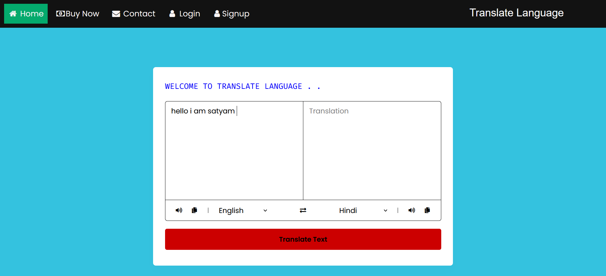

# Language-Transalator-App
- This is Cool and amazing website to convert one language to another language. This language translator to added 32
  language such as French , Basque, spanish etc.    
- There are also many web application available that may not support all the functionalities like scanning text, speech
  recognition and translates the text and which are applicable for specific and limited languages which are not useful for all
  the users. So here in the proposed system where we will be implementing translation with support all the functionalities
  like scanning text, speech recognition and translates the text and includes the languages which are popular in our country
  as  well as popular all over the world.

<h1 align="center">
   
    
   
</h1>
